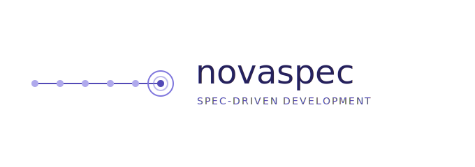

<p align="center">
  
</p>

<p align="center">
  <strong>Spec-Driven Development sobre Claude Code.</strong><br>
  De ticket de Jira a PR mergeado en pasos explícitos, con memoria arquitectónica que no decae.
</p>

---

## Qué es

`nova-spec` añade a Claude Code siete comandos `/nova-*` que convierten un ticket en un cambio trazable: clasificar, cerrar requisitos, planificar, implementar tarea a tarea, revisar y cerrar con commit + PR + actualización de memoria. La memoria (`context/decisions/`, `context/gotchas/`, `context/services/`) vive en archivos markdown atómicos que el humano edita y grep encuentra.

No es una plantilla ni un generador. Es un conjunto de convenciones + comandos que Claude Code ejecuta como slash commands en tu repo.

## Por qué existe

Sin disciplina, un agente escribe código rápido y pierde el porqué. Al siguiente ticket hay que re-explicar el mismo contexto. `nova-spec` impone checkpoints humanos, separa spec de tareas ejecutables, y deja rastro en `context/` para que el próximo ticket arranque informado.

## Quickstart

```bash
# 1. Clonar el repo nova-spec en tu máquina (una sola vez)
git clone https://github.com/adansuku/nova-spec.git ~/tools/nova-spec

# 2. Desde el repo donde quieres usarlo
cd /ruta/a/tu-proyecto
bash ~/tools/nova-spec/install.sh

# 3. Abre Claude Code y lanza el primer ticket
claude
/nova-start PROJ-123
```

Detalles completos en [INSTALL.md](./INSTALL.md).

## Flujo

```
/nova-start → /nova-spec → /nova-plan → /nova-build → /nova-review → /nova-wrap
```

| Comando | Qué hace |
|---|---|
| `/nova-start <TICKET>` | Baja el ticket, clasifica (quick-fix / feature / architecture), crea rama, carga contexto |
| `/nova-spec` | Cierra decisiones abiertas y escribe `proposal.md` |
| `/nova-plan` | Traduce la spec en `tasks.md` (plan + tareas) |
| `/nova-build` | Ejecuta tareas una a una con review incremental |
| `/nova-review` | Code review final contra spec, convenciones y decisiones |
| `/nova-wrap` | Actualiza memoria, archiva spec, commit y PR |
| `/nova-status [TICKET]` | Estado actual del ticket (solo lectura) |

Los `quick-fix` saltan `/nova-spec` y `/nova-plan`.

## Principios

- **No saltar pasos**. Cada comando tiene un guardrail que comprueba precondiciones.
- **No inventar contexto**. Si falta info, el comando pregunta.
- **Checkpoints humanos** tras `/nova-spec` y antes de `/nova-wrap`.
- **Memoria que no decae**: un hecho = un archivo, nombre = índice, supersede explícito.

## Documentación

- Instalación detallada: [INSTALL.md](./INSTALL.md)
- Arquitectura interna: [novaspec/README.arch.md](./novaspec/README.arch.md)
- Referencia rápida: [novaspec/README.quickref.md](./novaspec/README.quickref.md)
- Modelo de memoria: [context/decisions/memoria-sencilla.md](./context/decisions/memoria-sencilla.md)
- Estructura de `context/`: [context/README.md](./context/README.md)
- Contribuir: [CONTRIBUTING.md](./CONTRIBUTING.md)

## Dogfood

Este repo se desarrolla con `nova-spec`. Las carpetas `context/decisions/`, `context/gotchas/` y `context/changes/archive/` contienen las decisiones y specs reales del propio framework — úsalas como ejemplo vivo de cómo se ve un proyecto maduro.

## Licencia

MIT — ver `LICENSE`.
